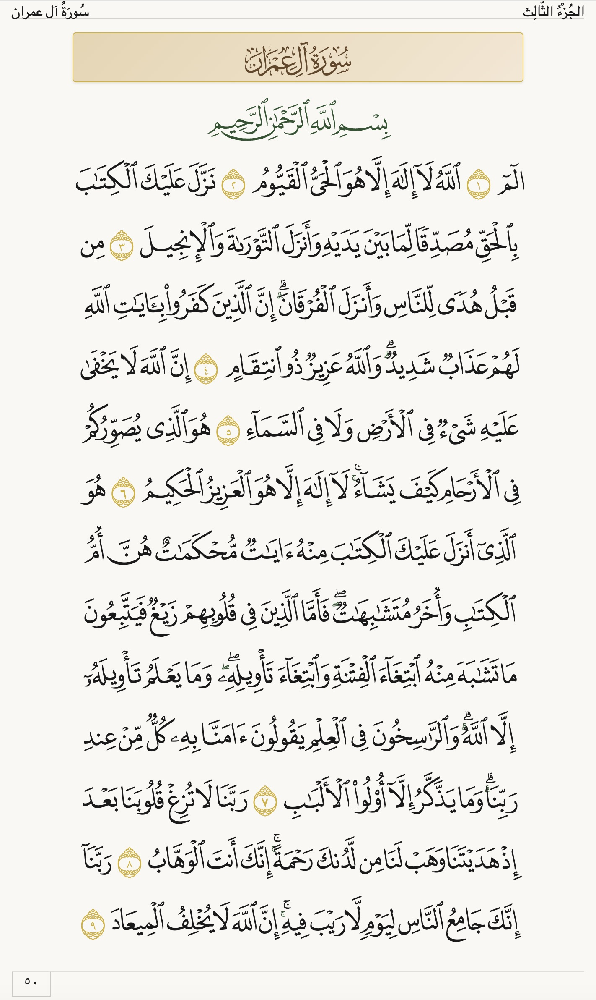
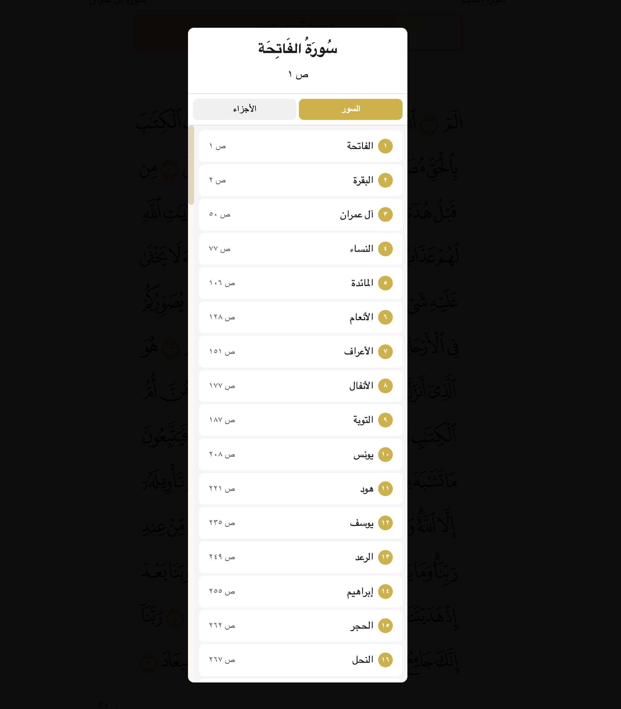

# 📖 Java Quran Web

> A simple yet elegant **Vanilla JavaScript** Quran web application displaying the authentic Mushaf Madina layout with QCF4 fonts.

[](LICENSE)
[](https://developer.mozilla.org/en-US/docs/Web/JavaScript)
[](CONTRIBUTING.md)

---

## 📸 Screenshots

<div align="center">

### Main Quran Page View

*Beautiful rendering of the Quran using QCF4 fonts with authentic Mushaf Madina layout*

### Navigation Modal

*Easy navigation through Surahs and Juz with an elegant modal interface*

</div>

---

## ✨ Overview

**Java Quran Web** is a lightweight, pure JavaScript web application that renders the Holy Quran in the traditional **Mushaf Madina** format. The project focuses on simplicity, performance, and authentic visual representation using the industry-standard **QCF4 (Quran Complex Fonts v4)** font system.

### Key Features

- 📜 **Authentic Mushaf Layout** - Pixel-perfect replication of the printed Mushaf Madina (604 pages)
- 🎨 **QCF4 Font System** - Professional-grade fonts from King Fahd Complex for Printing the Holy Quran
- ⚡ **Zero Dependencies** - Pure vanilla JavaScript, HTML, and CSS
- 📱 **Responsive Design** - Optimized for desktop and mobile devices
- 🧭 **Easy Navigation** - Browse by Surah, Juz, or page number
- 🎯 **Verse Highlighting** - Interactive verse-level highlighting on hover
- 🔄 **RTL Support** - Full right-to-left layout for Arabic text
- 🚀 **Fast Loading** - Dynamic font loading and efficient rendering

---

## 🛠️ Technology Stack

This project is built with **pure web technologies**, no frameworks required:

- **HTML5** - Semantic markup and modern web standards
- **CSS3** - Custom styling with CSS Grid and Flexbox
- **Vanilla JavaScript (ES6+)** - No frameworks, just clean modern JS
- **QCF4 Fonts** - Official Quran fonts in WOFF2 format

### Why Vanilla JavaScript?

We chose vanilla JavaScript to:
- ✅ Keep the project lightweight and fast
- ✅ Avoid framework bloat and dependencies
- ✅ Make the codebase accessible to all developers
- ✅ Ensure long-term compatibility and maintainability
- ✅ Focus on web fundamentals

---

## 📁 Project Structure

```
Java-Quran-Web/
├── index.html              # Main HTML entry point
├── css/
│   ├── app.css            # Main application styles
│   └── qcf4-fonts.css     # QCF4 font declarations
├── js/
│   ├── app.js             # Main application controller
│   ├── data-loader.js     # Data fetching and parsing
│   ├── navigation.js      # Navigation logic (optional)
│   └── renderer.js        # Page rendering engine
├── assets/
│   └── fonts/
│       ├── qcf4/          # QCF4 font files (WOFF2)
│       └── kitab/         # Kitab font files (WOFF2)
└── data/
    ├── suwar.json         # Surah metadata
    ├── page_mapping.json  # Page-to-verse mappings
    ├── mushaf_metadata.json # Layout metadata
    └── quran_layout.csv   # Glyph positioning data
```

---

## 🚀 Getting Started

### Prerequisites

- A modern web browser (Chrome, Firefox, Safari, Edge)
- A local web server (for development)

### Installation

1. **Clone the repository**
   ```bash
   git clone https://github.com/yourusername/Java-Quran-Web.git
   cd Java-Quran-Web
   ```

2. **Start a local server**
   ```bash
   # Using Python 3
   python -m http.server 8000
   
   # Using Node.js
   npx http-server
   
   # Using PHP
   php -S localhost:8000
   ```

3. **Open in browser**
   
   Navigate to `http://localhost:8000` in your browser.

---

## 🎯 Usage

### Basic Navigation

- **Arrow Buttons** - Click the left/right arrows to navigate between pages
- **Header/Footer Click** - Click on the page header or footer to open the navigation modal
- **Surah Navigation** - Browse and jump to any Surah from the navigation menu
- **Juz Navigation** - Access any of the 30 Juz sections

### URL Navigation

You can navigate directly to any page using URL hashes:
```
http://localhost:8000/#page/1    # Al-Fatiha (Page 1)
http://localhost:8000/#page/293  # Al-Kahf (Page 293)
```

### Verse Interaction

- **Hover** - Hover over any verse to see highlighting
- **Click** - Click on a verse group to interact (feature can be extended)

---

## 🏗️ Architecture

### Core Components

#### 1. **QuranApp** (`app.js`)
The main application controller that:
- Initializes the data loader and renderer
- Manages application state
- Handles navigation between pages
- Controls the overlay modal for navigation

#### 2. **QuranDataLoader** (`data-loader.js`)
Responsible for:
- Loading all Quran data files
- Parsing CSV layout data
- Providing data access methods
- Caching loaded data

#### 3. **PageRenderer** (`renderer.js`)
Handles:
- Dynamic font loading
- Page layout rendering
- Glyph-by-glyph positioning
- Header and footer generation
- Verse grouping and highlighting

### Data Flow

```
User Action → QuranApp → DataLoader → Renderer → DOM Update
```

1. User navigates to a page
2. QuranApp requests page data from DataLoader
3. Renderer fetches layout data for that page
4. Fonts are dynamically loaded if needed
5. Page is rendered line-by-line with proper formatting

---

## 🎨 Styling

The application uses a carefully crafted color scheme inspired by traditional Quran manuscripts:

```css
--primary-color: #2c5530;   /* Dark green */
--secondary-color: #d4af37;  /* Gold */
--bg-color: #faf8f3;         /* Off-white */
--text-color: #1a1a1a;       /* Near black */
--border-color: #e0d4b8;     /* Beige */
```

### Responsive Design

The application adapts to different screen sizes:
- Desktop: Full Mushaf page view
- Tablet: Optimized layout with touch controls
- Mobile: Single-column view with adjusted font sizes

---

## 📊 Technical Details

### QCF4 Font System

The QCF4 fonts are vector-based fonts that encode:
- Arabic Quranic text glyphs
- Tajweed rules
- Pause marks (waqf signs)
- Verse endings (ayah markers)
- Chapter decorations (surah names)

Each glyph is mapped to a Unicode character in the Private Use Area (0xF100+).

### Mushaf Layout

The application renders all 604 pages of the Mushaf Madina:
- **15 lines per page** - Exact match to printed Mushaf
- **Dynamic line centering** - Specific lines are centered per page
- **Page headers** - Display Surah name and Juz number
- **Page footers** - Show Arabic page numbers
- **Basmalah placement** - Special handling for "بسم الله الرحمن الرحيم"

---

## ⚠️ Known Issues

- **Dynamic Resizing**: The application currently encounters layout issues when dynamically resizing on certain screen resolutions. The text scaling and grid alignment need improvement to ensure a consistent experience across all devices. **Fixing this is currently a top editorial priority.**

---

## 🤝 Contributing

**We need your help to make this better!**

This is a simple, clean implementation, but there's always room for improvement. Here's how you can contribute:

### Ways to Contribute

1. **🐛 Report Bugs** - Found an issue? [Open an issue](https://github.com/yourusername/Java-Quran-Web/issues)
2. **💡 Suggest Features** - Have an idea? We'd love to hear it!
3. **📝 Improve Documentation** - Help make the docs clearer
4. **🎨 Enhance Design** - Improve the UI/UX
5. **⚡ Optimize Performance** - Make it faster
6. **🧪 Add Tests** - Help us build a test suite
7. **🌍 Add Translations** - Translate the interface to other languages

### Feature Ideas

Some areas where we need help:

- [ ] **Bookmarking System** - Save favorite pages
- [ ] **Search Functionality** - Search by keyword or verse reference
- [ ] **Audio Integration** - Add recitation playback
- [ ] **Translation Layer** - Display translations alongside Arabic text
- [ ] **Dark Mode** - Add a dark theme option
- [ ] **Offline Support** - Implement Service Workers for offline access
- [ ] **Touch Gestures** - Swipe navigation for mobile
- [ ] **Keyboard Shortcuts** - Power user features
- [ ] **Print Optimization** - Better print layouts
- [ ] **Accessibility** - Screen reader support and ARIA labels

### Development Workflow

1. Fork the repository
2. Create a feature branch (`git checkout -b feature/amazing-feature`)
3. Make your changes
4. Test thoroughly
5. Commit your changes (`git commit -m 'Add amazing feature'`)
6. Push to your branch (`git push origin feature/amazing-feature`)
7. Open a Pull Request

### Code Style

- Use clear, descriptive variable names
- Add comments for complex logic
- Follow existing code patterns
- Keep functions small and focused
- Test on multiple browsers

---

## 📜 License

This project is licensed under the **GNU General Public License v3.0** - see the [LICENSE](LICENSE) file for details.

### Font Licensing

The QCF4 fonts are proprietary to the **King Fahd Complex for the Printing of the Holy Quran**. Please ensure you have the proper licensing to use these fonts in your project.

---

## 🙏 Acknowledgments

- **King Fahd Complex** - For the QCF4 font system
- **All Contributors** - For making this project better

---

## 💻 Browser Support

| Browser | Version | Status |
|---------|---------|--------|
| Chrome  | 90+     | ✅ Fully Supported |
| Firefox | 88+     | ✅ Fully Supported |
| Safari  | 14+     | ✅ Fully Supported |
| Edge    | 90+     | ✅ Fully Supported |
| Opera   | 76+     | ✅ Fully Supported |

---

## 📈 Roadmap

### Version 1.0 (Current)
- [x] Basic Mushaf rendering
- [x] Page navigation
- [x] Surah and Juz navigation
- [x] Responsive design

### Version 1.1 (Planned)
- [ ] Search functionality
- [ ] Bookmarking system
- [ ] Settings panel
- [ ] Performance optimizations

### Version 2.0 (Future)
- [ ] Audio recitation
- [ ] Translation overlay
- [ ] Advanced search
- [ ] PWA support
- [ ] Multi-language interface

---

## ⭐ Show Your Support

If you find this project useful, please consider:

- ⭐ Starring the repository
- 🐛 Reporting bugs
- 💬 Sharing feedback
- 🤝 Contributing code
- 📢 Spreading the word

---

<div align="center">

**Made with ❤️ for the Muslim Ummah**

*Jazakum Allahu Khairan - May Allah reward you with goodness*

</div>
